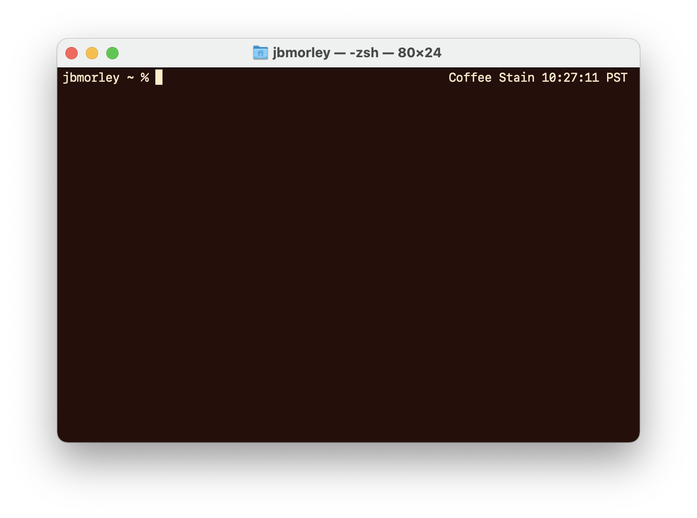
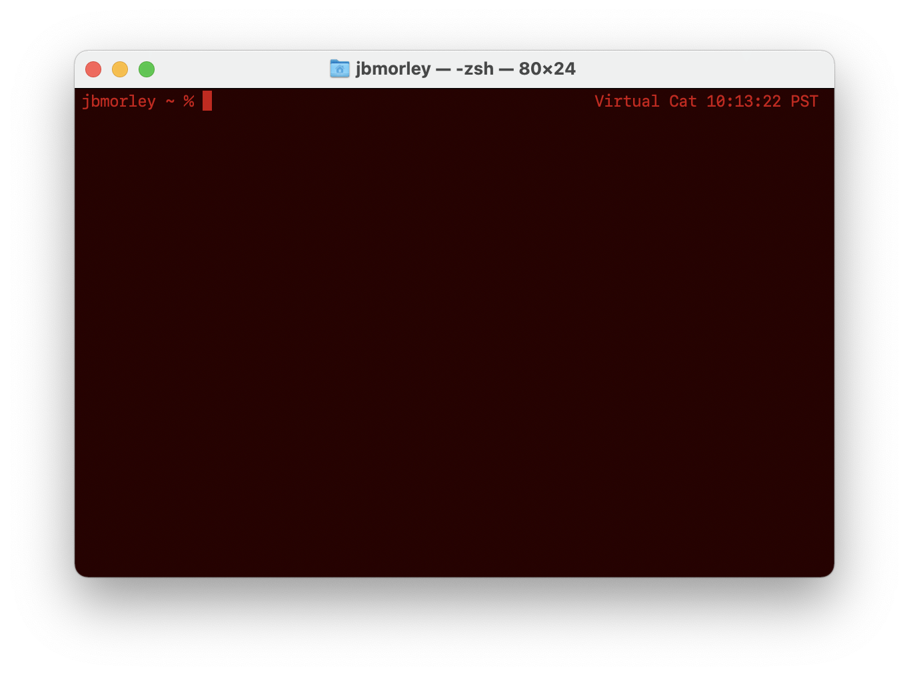

# Gato Roboto Terminal Themes

[Gato Roboto](https://gatoroboto.com) inspired themes for Terminal.app


## Installation

```zsh
git clone git@github.com:jbmorley/gato-roboto-themes.git
cd gato-roboto-themes
./gr install
```

## Usage

- Install the themes:

  ```zsh
  gr install
  ```

- Set a theme (e.g., `tamagato`):

  ```zsh
  gr set tamagato
  ```

- Set a random theme:

  ```zsh
  gr random
  ```

- Demo all the themes:

  ```zsh
  gr demo
  ```

## Themes

### Bark


```zsh
gr set bark
```

### Chewed Gum


```zsh
gr set chewed-gum
```

### Coffee Stain



```zsh
gr set coffee-stain
```

### Default


```zsh
gr set default
```

### Goop


```zsh
gr set goop
```

### Grape


```zsh
gr set grape
```

### Gris


```zsh
gr set gris
```

### Meowtrix


```zsh
gr set meowtrix
```

### Nicotine


```zsh
gr set nicotine
```

### Port


```zsh
gr set port
```

### Soft


```zsh
gr set soft
```

### Starboard


```zsh
gr set starboard
```

### Swamp Matcha


```zsh
gr set swamp-matcha
```

### Tamagato


```zsh
gr set tamagato
```

### Urine


```zsh
gr set urine
```

### Virtual Cat



```zsh
gr set virtual-cat
```
